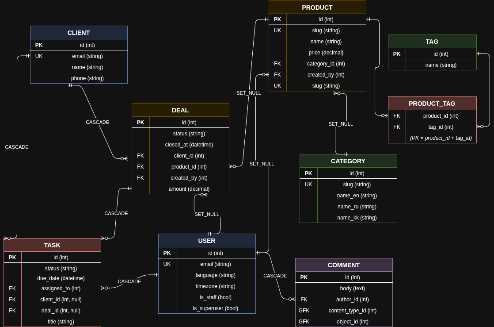

# Prostoi CRM


## Overview

Prostoi CRM is an automated inventory and customer relationship management system designed for small shop owners in the Kazakhstan market. The project combines CRM workflows, inventory visibility, secure REST APIs, asynchronous automation, real-time updates, and multilingual support for English, Russian, and Kazakh.

This repository was built as a university capstone project and demonstrates production-oriented Django backend architecture with Docker, PostgreSQL, Redis, Celery, Django Channels, JWT authentication, and interactive API documentation.

## ER Diagram



## Key Features

- **RESTful API with JWT Authentication & Custom User Model**
  - Custom email-based `users.User` model.
  - JWT registration, login, refresh, and verify endpoints with `djangorestframework-simplejwt`.
  - Authenticated `/api/auth/me/` profile endpoint with language and timezone preferences.

- **Complex Database Relationships**
  - `Product` to `Tag` many-to-many relationship.
  - `Comment` uses Django `GenericForeignKey` to attach comments to both `Task` and `Deal`.
  - `Deal`, `Task`, `Product`, `Client`, `Category`, and `Tag` models use relational integrity and indexed fields.
  - Querysets are optimized with `select_related`, `prefetch_related`, `Prefetch`, and annotations such as `deals_count`.

- **Asynchronous Tasks**
  - Celery worker service for background jobs.
  - Celery Beat service for scheduled automation.
  - Client creation queues a welcome email task.
  - Daily stock checks run through Celery Beat.

- **Real-time Data**
  - Django Channels and Daphne power ASGI/WebSocket support.
  - Inventory updates are broadcast through `/ws/inventory/`.
  - Redis-backed channel layer via `channels-redis`.

- **Performance & Security**
  - Redis cache-aside pattern for deal list responses.
  - Deal cache invalidation on create, update, and delete.
  - Redis-backed fixed-window rate limiting middleware.
  - Production settings include secure cookies, HSTS, CORS allowlist support, and PostgreSQL configuration.
  - Docker container runs the Django application as a non-root user.

- **Full Localization**
  - Internationalization enabled with English, Russian, and Kazakh.
  - User preference middleware activates each authenticated user's language and timezone.
  - Anonymous requests can fall back to the `Accept-Language` header.
  - Localized category names support `name_en`, `name_ru`, and `name_kk`.

## Tech Stack

- **Language:** Python 3.12
- **Backend Framework:** Django 4.2, Django REST Framework
- **Authentication:** Simple JWT
- **Database:** PostgreSQL 16 in Docker, SQLite for local development settings
- **Cache / Broker:** Redis 7
- **Async Jobs:** Celery 5.3.6, Celery Beat
- **Realtime:** Django Channels, Daphne, channels-redis
- **API Docs:** drf-spectacular, Swagger UI, ReDoc
- **Filtering:** django-filter
- **Caching:** django-redis
- **Testing:** pytest, pytest-django, pytest-cov, Django TestCase, DRF APIClient
- **Tooling:** Docker, Docker Compose, Ruff
- **Localization:** Django i18n with EN, RU, KK locales

## Quickstart (Docker)

The Docker setup runs the full backend stack:

- `web` - Django ASGI app served by Daphne
- `celery-worker` - Celery background worker
- `celery-beat` - scheduled Celery jobs
- `db` - PostgreSQL 16
- `redis` - Redis 7

### 1. Clone the repository

```bash
git clone <https://github.com/prosto-ioi/Prostoi-CRM-project.git>
cd final
```

### 2. Create the root `.env` file

This repository expects a `.env` file in the project root because `docker-compose.yml` loads it with `env_file`.

```bash
cat > .env <<'EOF'
CRM_SECRET_KEY=replace-this-with-a-long-random-secret-key
CRM_DB_NAME=prostoi_crm
CRM_DB_USER=prostoi_crm
CRM_DB_PASSWORD=prostoi_crm_password
CRM_ALLOWED_HOSTS=localhost,127.0.0.1,0.0.0.0
CRM_CORS_ORIGINS=http://localhost:3000,http://localhost:5173,http://127.0.0.1:8000
CRM_LOG_LEVEL=INFO
EOF
```

`docker-compose.yml` injects Docker-specific service hosts automatically:

- `CRM_ENV_ID=prod`
- `CRM_DB_HOST=db`
- `CRM_DB_PORT=5432`
- `CRM_REDIS_URL=redis://redis:6379/0`
- `CRM_CELERY_BROKER_URL=redis://redis:6379/1`
- `CRM_CELERY_RESULT_BACKEND=redis://redis:6379/1`

### 3. Build and start the stack

```bash
docker compose up --build
```

If your Docker installation uses the legacy Compose binary, the equivalent command is:

```bash
docker-compose up --build
```

The `web` container entrypoint waits for PostgreSQL, applies migrations automatically, and then starts Daphne on port `8000`.

### 4. Open the application endpoints

- API root: `http://127.0.0.1:8000/api/crm/`
- Swagger UI: `http://127.0.0.1:8000/api/docs/`
- ReDoc: `http://127.0.0.1:8000/api/redoc/`
- OpenAPI schema: `http://127.0.0.1:8000/api/schema/`
- Django Admin: `http://127.0.0.1:8000/admin/`
- Inventory WebSocket: `ws://127.0.0.1:8000/ws/inventory/`

### 5. Stop the stack

```bash
docker compose down
```

To remove persisted PostgreSQL and Redis volumes as well:

```bash
docker compose down -v
```

## Automation & Seeding

### Database Seeding

The project includes an idempotent custom seeding management command implemented as `fill_db`. It is the repository's implemented equivalent of a `seed_db` command.

Run it inside the Docker web container:

```bash
docker compose exec web python manage.py fill_db
```

The command creates realistic demo data:

- users
- categories
- tags
- clients
- products
- deals
- tasks
- generic comments

Demo accounts created by the seeder use this password:

```text
Test1234!
```

| Email | Role | Language |
|---|---|---|
| `manager1@crm.com` | Manager | Russian |
| `manager2@crm.com` | Manager | Kazakh |
| `manager3@crm.com` | Manager | English |
| `staff@crm.com` | Staff / Admin | Russian |

### Redis Pub/Sub Listener

The project also includes a deal event listener:

```bash
docker compose exec web python manage.py listen_deals
```

Deal create, update, and delete events are published to the Redis channel `crm:deals`.

### Shell Scripts

This repository uses root-level shell scripts for automation:

- `entrypoint.sh`
  - Used by Docker.
  - Waits for PostgreSQL.
  - Runs migrations.
  - Starts the container command.

- `start.sh`
  - Local development bootstrap script.
  - Expects `settings/.env`.
  - Creates a virtual environment.
  - Installs `requirements/dev.txt`.
  - Applies migrations.
  - Collects static files.
  - Compiles translations.
  - Creates a default admin user.
  - Runs `python manage.py fill_db`.

For local script usage, create `settings/.env` with at least:

```bash
CRM_SECRET_KEY=replace-this-with-a-long-random-secret-key
CRM_ENV_ID=local
```

Then run:

```bash
./start.sh
```

The local script creates this admin account if it does not already exist:

```text
admin@crm.com / admin123
```

## Running Tests

The repository contains 100+ tests covering authentication, JWT flows, permissions, CRUD behavior, filtering, Generic Foreign Keys, localization, user preferences, and dashboard stats.

Install development dependencies first:

```bash
pip install -r requirements/dev.txt
```

Set the Django test environment:

```bash
export CRM_SECRET_KEY=test-secret-key
export CRM_ENV_ID=local
export DJANGO_SETTINGS_MODULE=settings.env.local
```

Run the full test suite:

```bash
python -m pytest
```

On systems where Python is installed as `python3`, use:

```bash
python3 -m pytest
```

To run tests inside the Docker web container, install development dependencies in the running container and execute pytest:

```bash
docker compose exec web sh -lc "python -m pip install --user -r requirements/dev.txt && python -m pytest"
```

## API Documentation

Interactive API documentation is generated with `drf-spectacular`.

After starting the server, open:

- Swagger UI: `http://127.0.0.1:8000/api/docs/`
- ReDoc: `http://127.0.0.1:8000/api/redoc/`
- OpenAPI schema: `http://127.0.0.1:8000/api/schema/`

Main API groups:

- Auth: `/api/auth/`
- CRM resources: `/api/crm/`
- Dashboard stats: `/api/stats/`
- Admin: `/admin/`

## Core API Endpoints

### Authentication

| Method | Endpoint | Description |
|---|---|---|
| `POST` | `/api/auth/register/` | Register a user and return JWT tokens |
| `POST` | `/api/auth/token/` | Obtain JWT access and refresh tokens |
| `POST` | `/api/auth/token/refresh/` | Refresh access token |
| `POST` | `/api/auth/token/verify/` | Verify token validity |
| `GET` | `/api/auth/me/` | Retrieve current user profile |
| `PATCH` | `/api/auth/me/` | Update current user profile |

### CRM

| Resource | Endpoint |
|---|---|
| Categories | `/api/crm/categories/` |
| Tags | `/api/crm/tags/` |
| Clients | `/api/crm/clients/` |
| Products | `/api/crm/products/` |
| Deals | `/api/crm/deals/` |
| Tasks | `/api/crm/tasks/` |
| Comments | `/api/crm/comments/` |
| Task comments | `/api/crm/tasks/<id>/comments/` |
| Dashboard stats | `/api/stats/` |

## Project Structure

```text
.
+-- apps/
|   +-- crm/
|   |   +-- management/commands/
|   |   |   +-- fill_db.py
|   |   |   +-- listen_deals.py
|   |   +-- cache.py
|   |   +-- consumers.py
|   |   +-- filters.py
|   |   +-- middleware.py
|   |   +-- models.py
|   |   +-- pubsub.py
|   |   +-- routing.py
|   |   +-- serializers.py
|   |   +-- tasks.py
|   |   +-- tests.py
|   |   +-- urls.py
|   |   +-- views.py
|   +-- users/
|   |   +-- middleware.py
|   |   +-- models.py
|   |   +-- serializers.py
|   |   +-- tests.py
|   |   +-- urls.py
|   |   +-- views.py
|   +-- utils/
|       +-- rate_limit.py
+-- docs/
|   +-- crm_erd.png
+-- locale/
|   +-- kk/
|   +-- ru/
+-- requirements/
|   +-- base.txt
|   +-- dev.txt
|   +-- prod.txt
+-- settings/
|   +-- env/
|   |   +-- local.py
|   |   +-- prod.py
|   +-- asgi.py
|   +-- base.py
|   +-- celery_app.py
|   +-- urls.py
|   +-- wsgi.py
+-- tests/
|   +-- test_api.py
+-- Dockerfile
+-- docker-compose.yml
+-- entrypoint.sh
+-- manage.py
+-- pyproject.toml
+-- start.sh
```

## License

This project was developed as a university capstone project.